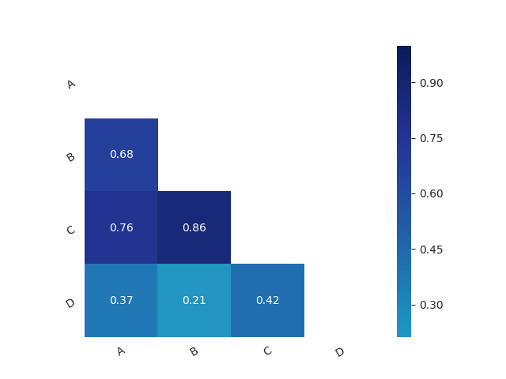

# portfolio

## Output
One of the objectives is to identify securities that are highly correlated together.


[](https://travis-ci.org/egenerat/portfolio)


## Local build and run


### Requirements:
- Node.js v10


### Install
```
npm install
```

Run tests
```
# Run all the tests
npm test
# Run one test
npm test -- test/test-financials.js
```

### Parser
With test data
```
./scripts/parser.js
```

With production data
```
NODE_ENV=production ./scripts/parser.js
```
or
```
export NODE_ENV=production
./scripts/parser.js
```

Extract data from one page
```
./scripts/parser-ng.js <URL>
```

### Analyzer

```
./scripts/analyzer.js --begin <date> --end <date>
```

## Correlations
```
pip install -r correlations/requirements-correlations.txt -r correlations/requirements-api.txt
./correlations/server.py
```